# Arduino/Teensy MediaButtons
March 16, 2021

## Overview

MediaButtons started out a simple project to use hardware buttons to control audio features on a connected USB host. Specifially, I wanted to have hardware buttons to control:

* Volume Up
* Volume Down
* Volume Mute
* Previous Track
* Play/Pause
* Next Track

I know a lot of us are thinking, 'My keyboard already does that!' Yeah, mine does, too, but you know what? I didn't build my keyboard and that's what I wanted to do.

So I needed to start making a list of requirements. Here's what I wanted:

1. Fun -- I want to build this myself
2. Free -- I want to use hardware that I already own
3. Simple -- I want to use USB and send the actual Media Keystrokes

Now I needed to decide what microcontroller I was going to use.

## Microcontroller

I already have too many boards laying around. I went an pulled out my drawer of microcontrollers and looky what I found:

* Raspberry Pi 3b
* Raspberry Pi 4
* BeagleBone Black
* Raspberry Pi Zero W
* Many Arduino Uno <-- Easily my favorite

The RPi 3 & 4 are just too powerful. I scratched them off the list. Same thing with the BBB. This left me with the Uno and the Pi0. The Pi0 was promising, so I looked into it.

#### Raspberry Pi Zero W

I immediately determined that this could do the work. It can act as a HID device. I found a couple of examples online that seemed to fit the bill, but you know what? I didn't have any prototyping hardware for the Pi0! I set it aside. Yes, I was willing to spend $1 to make this work, *but only if needed*.

#### Arduino Uno

The Arduino Uno is by far my favorite microcontroller. It's cheap. It's easy. It's fun. What's not to like? Hmm... well no HID support for one. "But, Eric, try the Due or the Zero!" Yes, the Due and the Zero support HID, but that would be violating one of my requirements of not buying another microcontroller and no matter what, I wasn't going to do that.

I got on the Internets and I found a probable solution: [NicoHood](https://github.com/NicoHood/HID)

I went trough the instructions and I used one Arduino to flash another Arduino. I thought that this was going to be the way then life brought me to Microcenter.

#### Microcenter

I live just outside of Los Angeles and pre-pandemic I would buy everything at Fry's in Anaheim. I've always looked down on Microcenter and I could never understand how they (of all places) managed to keep the lights on. Also, like many people, I'm trying to get a new video card. Not so easy right now, is it? Downright impossible as it turns out. About a week ago, I received a message that Microcenter in Tustin, CA had some video cards just sitting on their shelf. I dropped everything I was doing and drove there. No video cards, but I did wander over to the embedded section to look for a nice little enclosure and guess what I found sitting there all by itself. A Teensy.

I had heard of Teensy before and I knew that this was the exact hardware that was made to do exactly what I wanted. I bought it.

My hardware decision was made! And it was a great choice. Nothing like buying another microcontroller.

- [x] Teensy 3.5
    * Product page: [https://www.pjrc.com/store/teensy35.html](https://www.pjrc.com/store/teensy35.html)
    * Where I bought it: [https://www.microcenter.com/product/470387/pjrccom-teensy-35-usb-development-board---without-pins](https://www.microcenter.com/product/470387/pjrccom-teensy-35-usb-development-board---without-pins)

## The Breadboard Version

### Hardware

Here is the quick version done on a breadboard. Do you need any instructions on this build? I hope not, because I don't have any... lol. I do, however, have a nice parts list and a high res photo of what I did.

Parts List:
* Teensy 3.5 [https://www.adafruit.com/product/3267](https://www.adafruit.com/product/3267) -- I believe you can buy this with the headers already soldered on. Maybe *you* want that, but boy do I need the practice.
* Breakaway Male Headers [https://www.adafruit.com/product/392](https://www.adafruit.com/product/392)
* Solid-core Wire [https://www.adafruit.com/product/1311](https://www.adafruit.com/product/1311)
* Full-size Breadboard [https://www.adafruit.com/product/239](https://www.adafruit.com/product/239)
* Buttons [https://www.adafruit.com/product/1119](https://www.adafruit.com/product/1119)

You can buy all of this at your local Microcenter. I had all of this stuff laying around, except for the Teensy. Try to use what ya got and get rid of some crap. This list is just in case you need to find it all online.

And here is the finished breadboard:

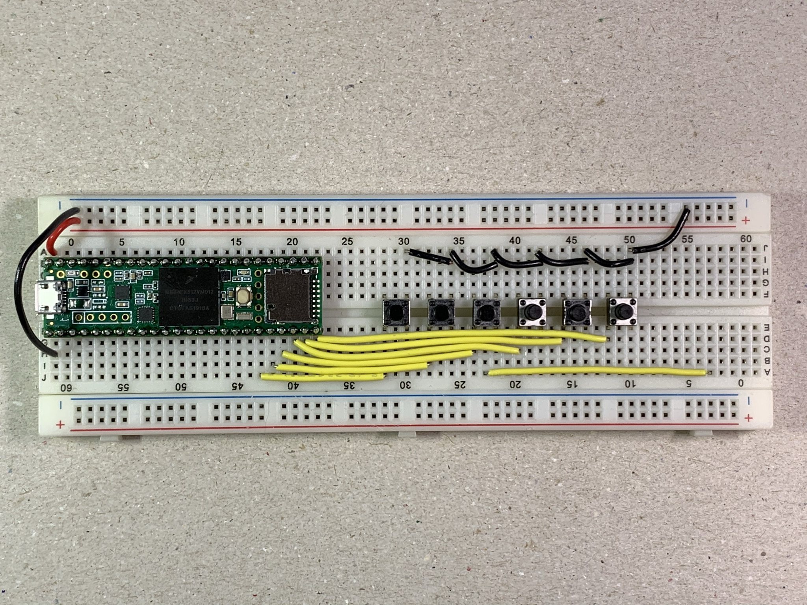

The buttons from left to right: Previous Track, Play/Pause, Next Track, Volume Down, Mute, Volume Up.

Yes, yes, we all see it and I know you're thinking, "What the heck is that extra yellow wire doing there?" Turns out it's just there for the ride.

### The MediaButtons BreadboardEasy Sketch

The complete Arduino sketch is right here: [BreadboardEasy](./Arduino/BreadboardEasy/BreadboardEasy.ino)

It's all very simple. Nothing fancy or tricky but let's look at one of the media keys. We're including a library called bounce.h from a fellow named Thomas Ouellet Fredericks. It helps take care of the built in chatter or bounce associated with buttons.

Here is the bare minimum to get a mute button working. If you do this x6 then you'll have a working project. Or, you can always download the completed sketch from above.
```C
#include <Bounce.h>

#define MUTE_PIN 31

Bounce volMuteButton = Bounce(MUTE_PIN, 10);

void setup() {
    pinMode(MUTE_PIN, INPUT_PULLUP);
}

void loop() {
    if (volMuteButton.fallingEdge()) {
    Keyboard.press(KEY_MEDIA_MUTE);
    Keyboard.release(KEY_MEDIA_MUTE);
    }
}
```
That sketch will run and to do that, you'll need to connect your teensy and set it up as a keyboard in the Arduino IDE Menu: Tools > USB Type > Keyboard

There's a little surprise if you decide to try this. Not only does the mute button mute the volume of the connected computer... it will also *unmute it!*

If you want to read more about the bounce.h library, there is a nice write-up at PJRC: [https://www.pjrc.com/teensy/td_libs_Bounce.html](https://www.pjrc.com/teensy/td_libs_Bounce.html)

## Upgrade #1: Adafruit Proto-board

### Hardware

That breadboard version is like really fun. Well, have you ever tried to change the volume from 12 to 100? I have and let me tell you, that's like 90 clicks. Who has the time for that?! Luckily, I saw this coming...

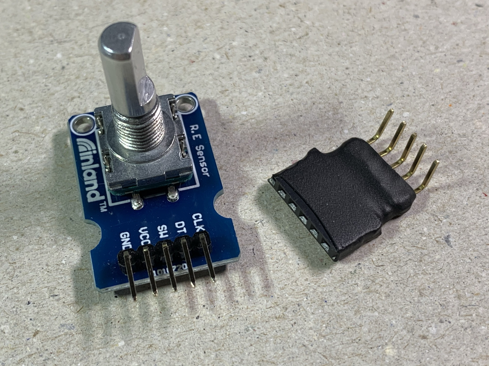

When I was at Microcenter I also bought this Inland Rotary Encoder (with an integrated clicky button). It cost $2.99. I'm going add it to the project for controlling volume and use the clicky button for mute. Also, I'm going to use one of my Adafruit Proto-boards (this is the one that fits in an Altoids tin).

Here's the updated parts list for Upgrade #1:
* Teensy 3.5 [https://www.adafruit.com/product/3267](https://www.adafruit.com/product/3267)
* Breakaway Male Headers [https://www.adafruit.com/product/392](https://www.adafruit.com/product/392)
* Solid-core Wire [https://www.adafruit.com/product/1311](https://www.adafruit.com/product/1311)
* \*Female Headers [https://www.adafruit.com/product/598](https://www.adafruit.com/product/598)
* \*Adafruit Proto-board [https://www.adafruit.com/product/1609](https://www.adafruit.com/product/1609)
* \*Lighted Arcade Buttons, Blue [https://www.adafruit.com/product/3490](https://www.adafruit.com/product/3490)
* \*Arcade Button Quick-connect [https://www.adafruit.com/product/1152](https://www.adafruit.com/product/1152)
* \*Rotary Encoder w/Integrated Button [https://www.microcenter.com/product/618904/inland-ks0013-keystudio-rotary-encoder-module](https://www.microcenter.com/product/618904/inland-ks0013-keystudio-rotary-encoder-module) (This encoder does not include a nut or a knob.)

\* = New to the list

Check out the soldered proto-board. Not my prettiest soldering job, but it all works.

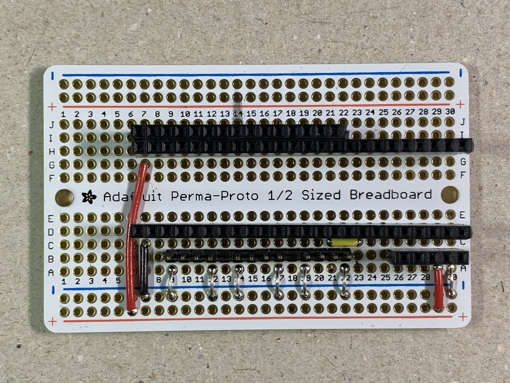 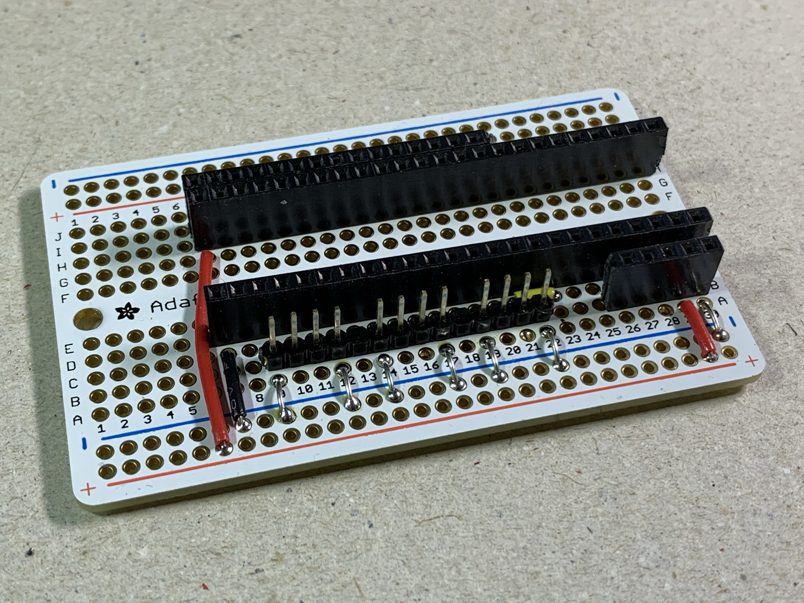

Note that tiny yellow jumper I snuck in there. I'll cover it in the step-by-step.

Wanna see ugly? Here's the back:

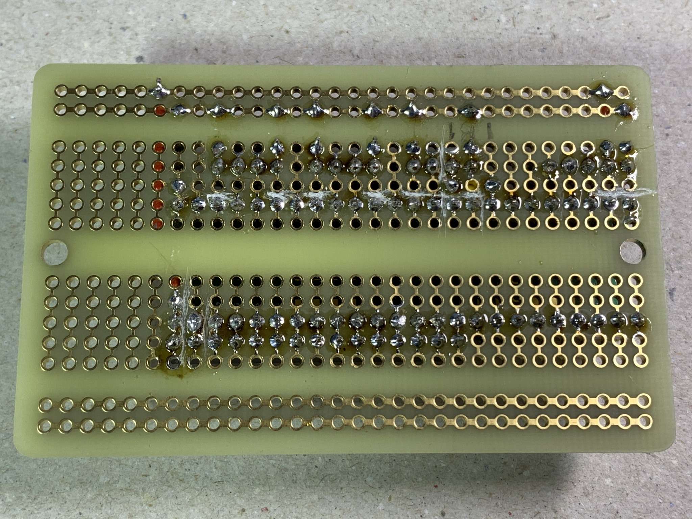

Do you see all of those scratches? The horizontal ones are just me cutting the traces so the board works. The vertical ones are me freaking out wondering why I solder so bad.

That's enough lookin'. Let's get to work.

#### Step-By-step

1. Teensy Socket Female Headers
    1. We need two 24-pin female sockets - cut the 25th socket in two female headers and you'll end up with two 24-pin sockets
    2. Solder these to the proto-board. Put one at H7 and the other at D7
2. Rotary Encoder Female Header
    1. We need a 5-pin female socket - cut the 6th socket in a female header and you'll have one 5-pin female header
    2. Solder this from B26 to B30
3. Button and LED Male Header
    1. Need a 14-pin male header
    2. Solder this to the board from B9 to B22
    3. SEMI-IMPORTANT: If you skip soldering pins 13 and 18, you can just pull the unsoldered pins out when you're done soldering the rest. This will make it all a little cleaner.
4. Cut the Traces
    1. We'll be cutting the tiny little metal trace between rows C and D
    2. Cut it at pins 9, 12, 14, 17, 19, 21, 22 for the LEDs and the Buttons
    3. Yes, I said pin 21 (see Step 8)
    4. Cut at pins 29 and 30 for the Rotary encoder
5. Solder power and ground for the Board
    1. Red wire from G7 to the bottom positive (+) line
    2. Black wire from C7 to the bottom negative (-) line
6. Solder ground for the LED, Buttons, Rotary Encoder
    1. Cut and then strip a 7" length of wire and cut it into 7 even lengths
    2. Jump and solder pins 9, 12, 14, 17, 19, 22, & 30 to the negative line
7. Solder power for the Rotary Encoder - solder a red wire from pin A29 to the power line
8. Jump pin C21 to C23
    1. This is because that location on the Teensy is 3.3v and we need a digital pin instead
    2. We already cut the trace for this at Step 4.3
9. Rejoice

   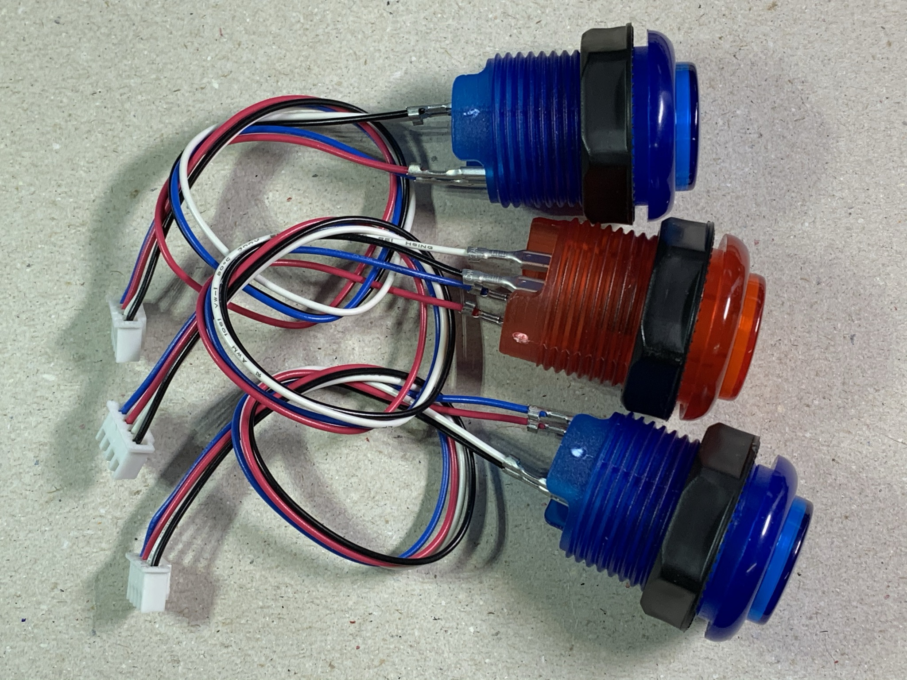  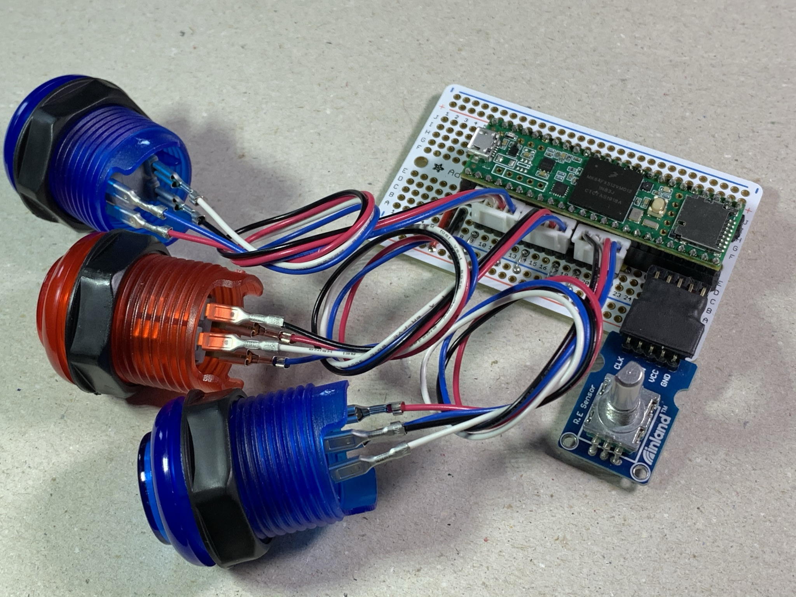

### The MediaButtons Adafruit Proto-board Sketch

Proto-board with rotary encoder Teensy/Arduino code is here: [ProtoboardEncoder](./Arduino/ProtoboardEncoder/ProtoboardEncoder.ino)


## Upgrade #2: Talking to the PC

### [NOTE: code completed, instructions not]

I thought a nice upgrade would be to display the current volume on an LCD attached to the Teensy. I thought it would be very simple so I added an LCD with an integrated I2C that I already had on-hand. I quickly realized that when I started up the PC, the Teensy wouldn't have any idea what the current volume was and further, it wouldn't know when I changed the volume using Windows.

This "server-side" code is used to read the current volume and any changes to the volume and send that value to the Teensy so the Teensy can accurately display it. This Windows app sits in the taskbar and will try to automatically configure itself to communicate with the Teensy, but if it gets it wrong you can set the COM port manually.

I also added code to the Teensy to handle the LCD and the COM port communications. Here is the last update for the proto-board with rotary encoder and LCD for the Teensy/Arduino: [ProtoboardLCD](./Arduino/ProtoboardLCD)

Here is the desktop code: [Desktop MediaButtons](./Desktop)

MediaButtons sits in the taskbar:


Here's the context menu:
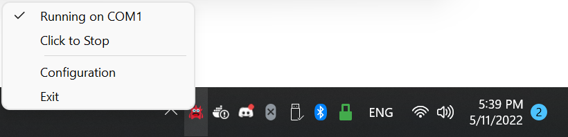

MediaButtons is running and it's talking to the Teensy:
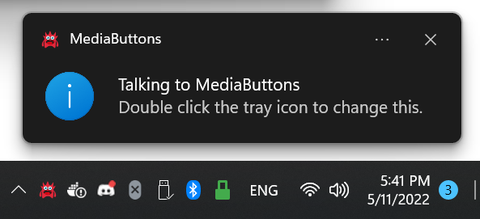

Stop!
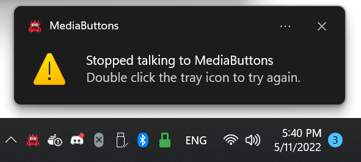

So many options...
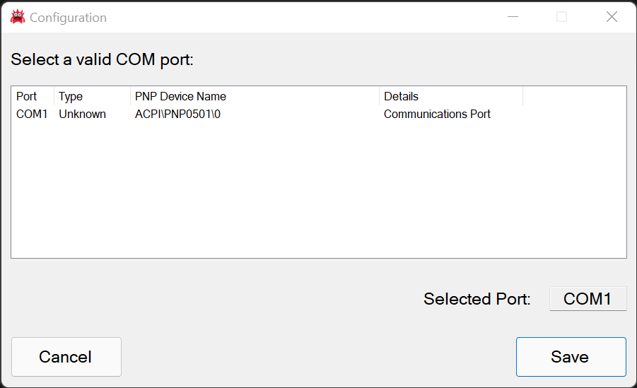

Parts List:
Here's the updated parts list for Upgrade #2:
* Teensy 3.5 [https://www.adafruit.com/product/3267](https://www.adafruit.com/product/3267)
* Breakaway Male Headers [https://www.adafruit.com/product/392](https://www.adafruit.com/product/392)
* Solid-core Wire [https://www.adafruit.com/product/1311](https://www.adafruit.com/product/1311)
* Female Headers [https://www.adafruit.com/product/598](https://www.adafruit.com/product/598)
* Adafruit Proto-board [https://www.adafruit.com/product/1609](https://www.adafruit.com/product/1609)
* Lighted Arcade Buttons, Blue [https://www.adafruit.com/product/3490](https://www.adafruit.com/product/3490)
* Arcade Button Quick-connect [https://www.adafruit.com/product/1152](https://www.adafruit.com/product/1152)
* Rotary Encoder w/Integrated Button [https://www.microcenter.com/product/618904/inland-ks0013-keystudio-rotary-encoder-module](https://www.microcenter.com/product/618904/inland-ks0013-keystudio-rotary-encoder-module) (This encoder does not include a nut or a knob.)
* \*LCD with I2C [https://www.amazon.com/SunFounder-Serial-Module-Display-Arduino/dp/B019K5X53O](https://www.amazon.com/SunFounder-Serial-Module-Display-Arduino/dp/B019K5X53O) (Make sure it has the integrated I2C!)

\* = New to the list

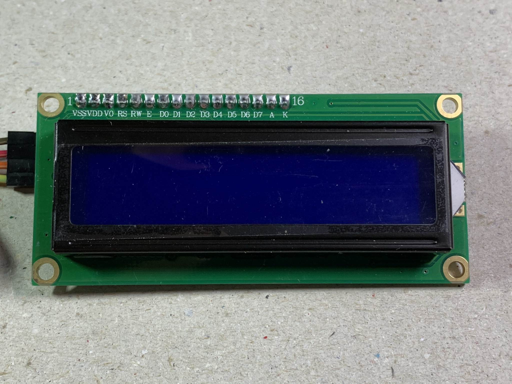 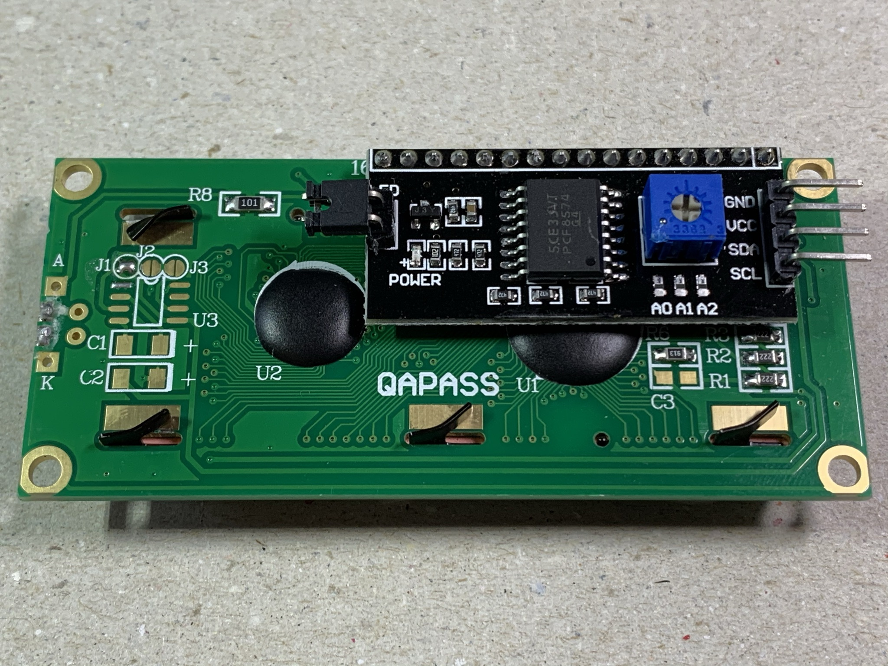 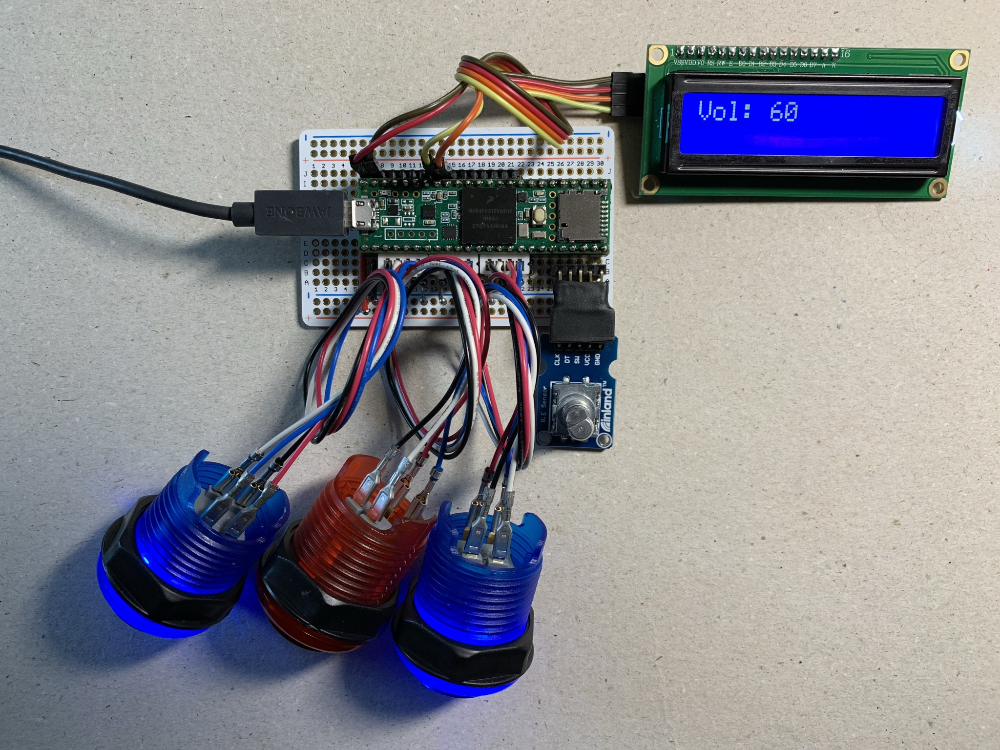
